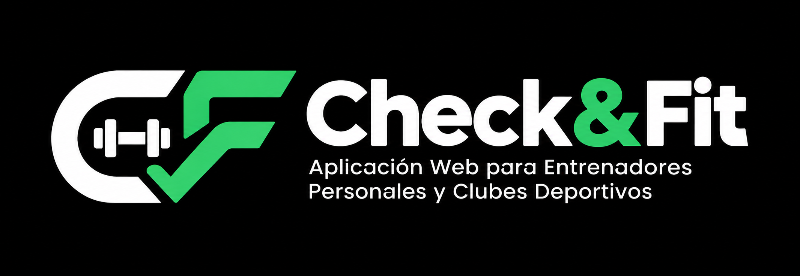
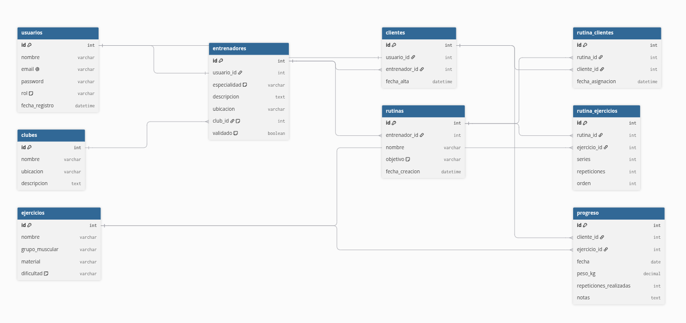

# Check&Fit - Aplicación Web para Entrenadores Personales y Clubes Deportivos

## 👥 Autor del Proyecto
Daniel Galiana

## 📌 Descripción General
Check&Fit es una aplicación web desarrollada que está orientada a dar a entrenadores personales y clubes deportivos (como boxeo) una herramienta para gestionar a sus propios clientes: crear y asignar rutinas de entrenamiento, hacer seguimiento del progreso, y disponer de un perfil público desde el que darse a conocer.

## 🎯 Objetivos del Proyecto
- Desarrollar una plataforma web segura y escalable para la gestión de entrenamientos y clientes.
- Implementar un sistema de autenticación y autorización por roles (administrador, entrenador, cliente).
- Facilitar al entrenador la creación, asignación y seguimiento de rutinas personalizadas.
- Permitir al cliente consultar su rutina y registrar su progreso.
- Aplicar conocimientos adquiridos sobre desarrollo web full-stack.

## 🛠️ Tecnologías Utilizadas

### Frontend
- **React** — construir las interfaces de cliente, entrenador y admin con componentes reutilizables.
- **React Router** — gestionar la navegación y proteger rutas según el rol del usuario.

### Backend
- **FastAPI** — exponer los endpoints REST y validar los datos de cada petición (incluye Python y Pydantic).
- **APScheduler** — programar la tarea diaria que revisa qué rutina toca a cada cliente para las notificaciones.

### Base de Datos
- **Supabase** — almacenar todos los datos y gestionar login/registro sin programar autenticación a mano (incluye PostgreSQL y Auth).
- **Row Level Security** — evitar que un cliente pueda leer datos de otro cliente aunque manipule la petición.

### Notificaciones
- Tabla `notificaciones` en Supabase, consultada desde React al entrar — mostrar los avisos (ejemplo: "hoy toca pecho") dentro de la propia web.

### Control de Versiones y Despliegue
- **GitHub** — versionar el código y desplegar el frontend automáticamente vía Vercel.
- **Render** — desplegar el backend de FastAPI.

## 🎨 Diseño y Recursos Visuales

## 💻 Ejemplos de la Aplicación
HACER ESO CUANDO LA PAGINA YA ESTA HECHA!!

 

HACER ESO CUANDO LA PAGINA YA ESTA HECHA!! 
